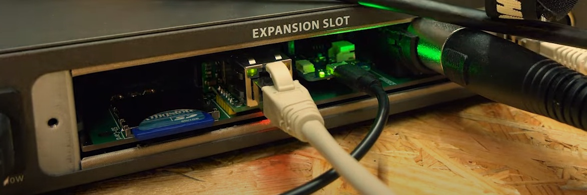
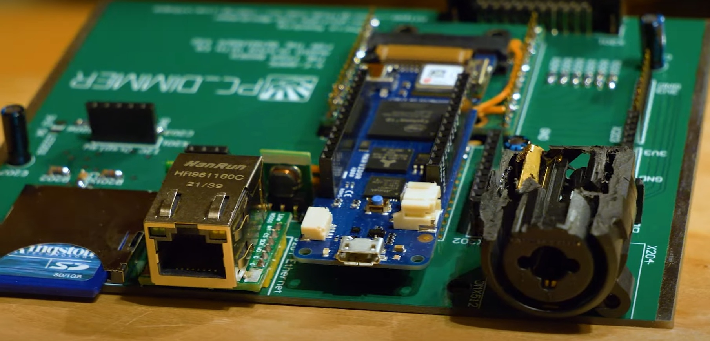
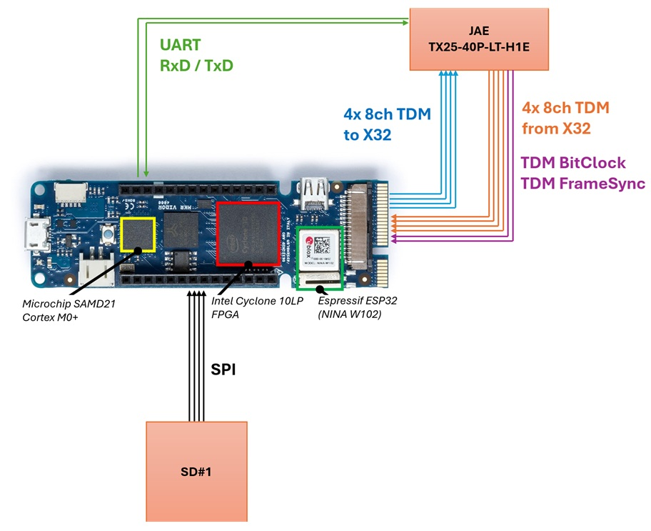
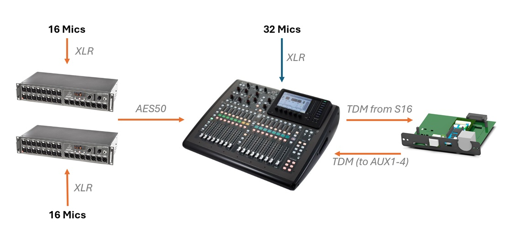
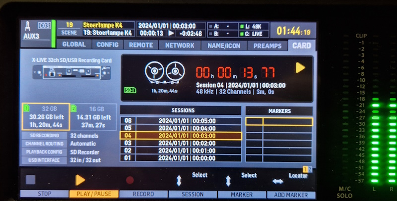
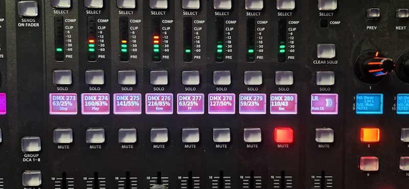
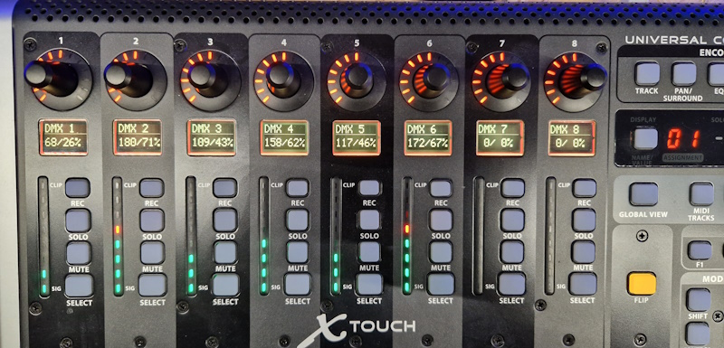
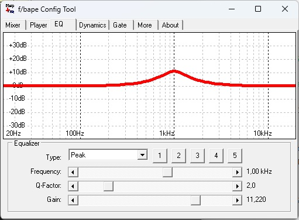

# X-f/bape - A DIY expansion-card for the Behringer X32

This repository contains the firmware for the X-f/bape DIY-ExpansionCard for the Behringer X32. This project
is based on the f/bape Audioplayer-project.

Three individual devices are part of this repository:

* Atmel/Microchip SAMD21 ATSAMD21G18A Cortex-M0+ 32-Bit Microcontroller
* Intel Cyclone 10LP 10CL016 FPGA
* uBlox NINA W102 (ESP32 D0WDQ6 Dual-Core)

## Main-Features of the system
- [x] Card receives, mix and sends 32 audio-channels with 48kHz and 24bit
- [x] MP3-Playback via SD-Card
- [x] Card-playback can be controlled via original X32-Card-interface
- [x] Control via Webinterface (only WiFi and only Audio yet)
- [x] Control via multiple X-Touch-controls via ethernet (Audio and DMX512)
- [x] Control via original Behringer X32Edit (via ethernet)
- [x] Control via X32-surface using MackieMCU-emulation via Card-MIDI (Audio and DMX512)
- [x] Control via ASCII-based commands via USB, WiFi and Ethernet (Audio and DMX512)
- [x] DMX512-output (adjustable DMX-timings via VHDL)
- [x] Parametric-Equalizers (3 to 5, depending on the free space in FPGA)
- [x] Dynamic Audio-Compression (Stereo)

Optional / prepared features:
- [x] control card via MQTT when using NINA W102 in Client-Mode WiFi
- [x] multi-channel analog Audio-Output via PDM / sigma-delta-modulation
- [x] Noise-Gates
- [x] Bluetooth-A2DP-Sink (larger ESP32 is nescessary)
- [x] 24dB/oct Linkwitz-Riley Crossover for tweeter and subwoofer (larger FPGA is nescessary)

## Current status of the project
This project is ready for smaller events. Audio-processing, audio-effects and DMX512 is working as well as support for MackieMCU-control via X32 or the X-Touch-Control via Ethernet.

However, as this project is a Hobby-project, please be aware, that this software/hardware-combination is not yet tested well. Everything seems to work somehow, but bugs will be here and there.

Some known bugs and limitations:
- [ ] Medium: EQs crackle on adjusting the frequency -> problem is solved when using a steep low-pass-filter with a cutoff frequency <=24kHz. No solution for the small FPGA within the Vidor4000
- [ ] Low: MP3 files must have the same samplerate (44,1kHz or 48kHz) as the main-console - otherwise the playback has some minor "hiss/noise". There is not enough space in the used FPGA to implement a samplerate-conversion yet.
- [ ] Low: Bluetooth is not working together with other features -> optimize code in NINA/ESP32 to save more space to enable BT. Probably not possible with the NINA-W102 on the Vidor4000

Usage of the components:
- FPGA: Logic Elements 97% of 15,408 LE / 9-bit Multiplier: 61% of 112 Multipliers
- SAMD21: 30% of 256kB / 58% of dynamic memory
- NINA-W102: 83% of 2 MB flash-memory

## Overview
The SAMD21 is used as an USB-2-UART converter for controlling and updating the individual devices. The device also controls the small I2C-display and communicates over the W5500-IC with your ethernet.
The FPGA receives audio-data via four TDM connections and control data via an UART-connection from the NINA W102. It also implements parametric equalizers, 36-channel volume-controls and a dynamic compression. A 24dB/oct Linkwitz-Riley Crossover is prepared but does not fit into the small FPGA yet.
The uBlox NINA W102 (ESP32) acts as a WiFi Accesspoint with webserver and implements the SD-card interface with MP3-decoder. It can be used to adjust audio-volume, select MP3-tracks adjust the equalizer and other functions of the system. It feeds the audio-data via I2S to the FPGA. It can be used to act as a Bluetooth-A2DP-sink as well.

As the original routing-functions of the Behringer X32 can still be used to route the individual channels, we are gaining more degree of freedom:
Using the 32 regular channels of the X32 and routing additional 32 channels from the AES50-connection to the X-f/bape-card, we can mix up to 64 channels in realtime with the X32. The X-f/bape will feed a submix to two of the 32 return-channels, that can be routed to two of the 6 AUX-Channels.
As the Cyclone 10LP is not the largest FPGA we are a bit limited with the EQing, but a 3-band PEQ with Compression is added to the submix.

## Connections
USB -> SAMD21 <-> FPGA <-> ESP32

## Uploading/Updating the firmware(s)
As this system uses several controllers and ICs, a total of three different firmwares have to be compiled and uploaded. The USB-port is connected to the SAMD21. So this is the first place for updates. As the SAMD21 acts as a JTAG-uploader for the FPGA, too, it will upload the bitstream for the FPGA together with its firmware. Finally, the SAMD21 can be set to an upload-mode, to update the NINA W102-module (ESP32).

### SAMD21 with bitstream for Intel Cyclone 10-FPGA
Start Intel Quartus Prime Lite and compile the logic. If you alreade have a file "bitstream.h" this is not nescessary. As the FPGA bitstream is part of the SAMD21 firmware, you have to update the FPGA-bitstream using this command before uploading the code to SAMD21:
    update_fpga_bitstream.bat

This batch-file will call the following command, to convert the TabularTextFile (TTF) into an Arduino-Header:

    ..\FPGA\Tools\vidorcvt\vidorcvt.exe < ..\FPGA\output_files\Audioplayer.ttf > bitstream.h
	
Now start the Arduino IDE in version 2.x. Connect the SAMD via USB and connect Arduino IDE to the designated port. Select "Arduino MKR Vidor 4000" as board and upload the software using the regular upload-functions of Arduino IDE. Next to the regular Arduino upload-function, the software bossac.exe can be used to upload the firmware without Arduino IDE:

* connect SAMD21 via USB
* initialize the bootloader of the SAMD21:
`mode COM5: BAUD=1200 parity=N data=8 stop=1 > nul`
upload the firmware
`bossac.exe --port=COM21 -I -U true -e -w Audioplayer.ino.bin -R`

Caution: As the power-demand of this board is quite high, use a sufficient power-supply for your USB-hub and a good cable!

### NINA WiFi-module
A firmware-update to the ESP32 is only possible, when SAMD21-controller is set to "passthrough-mode" so that an UART communication to the ESP32 is possible directly through SAMD21 and the FPGA. So first, open a terminal and send the following command to the SAMD21:

    samd:update:nina
Alternatively you can open the updatemode using windows-command-line (in this example the Vidor is connected to COM5):

    echo samd:update:nina > COM5
Then use the Arduino IDE to upload the new software using the built-in uploading-functions for the ESP32 uBlox NINA W102. An upload is possible using the esptool.exe, directly:

    Tools\esptool.exe --chip esp32 --port COM5 --baud 921600 --before default_reset --after hard_reset write_flash -z --flash_mode dio --flash_freq 80m --flash_size 2MB 0x1000 Update\NINA.bootloader.bin 0x8000 Update\NINA.partitions.bin 0xe000 Tools\boot_app0.bin 0x10000 Update\NINA.bin
After uploading the new firmware, please reset the board using the RESET-button.

### Some pitfalls
[x] Don't forget to close the COM-port-connection, when trying to upload the SAMD-firmware
[x] COM-ports above "9" (hence, two-digit-COM-ports) seem to rise some problems on later Windows 11 releases. The command "echo samd:update:nina > COM10" works under Windows 10, but not under Windows 11 24H2. Same when uploading to NINA W102/ESP32. So switch to a COM-port below 10 if you have problems.
[x] Sometimes the bootloader of the SAMD21 is not called correctly. If the Arduino IDE seems to wait for a longer time, double-press the RESET-button on the Vidor4000 to call the bootloader manually

## Graphical User Interfaces

There are several options to control this system:
* Directly on X32 using the MIDI-Remote in MackieMCU-mode (directly via Expansion Slot)
* X-Touch via Ethernet (multiple X-Touch are supported)
* WiFi via integrated Webinterface
* UART via FBAPE.EXE
* via ASCII-commands via UART and Ethernet

Here are some pictures to demonstrate the usage:

MP3s can be played using the original X-LIVE-Controls:

32-Audio channel and DMX512 can be controlled using the X32 in MIDI-Remote-Mode:

The X-Touch are supported as well:

The Windows-GUI is available as Windows11-App

As the Ethernet-Contoller is connected only to the SAMD21, the webinterface of the NINA-W102 cannot be accessed. Maybe we can change this in a later design. But for now the ethernet-port is limited to plain ASCII-commands.